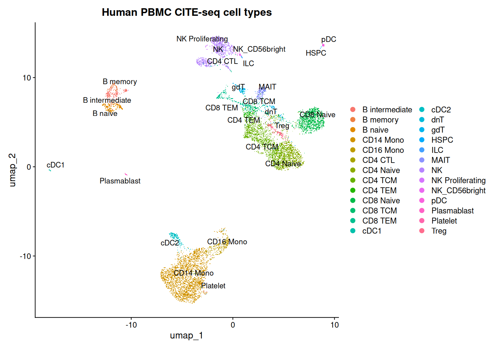
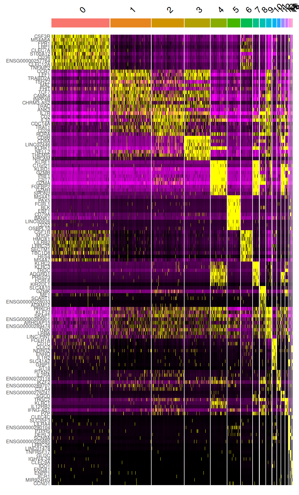
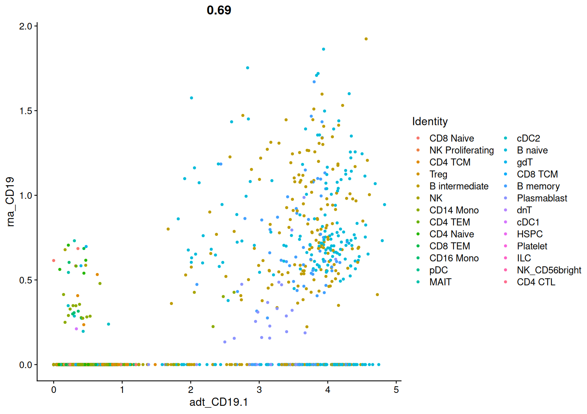
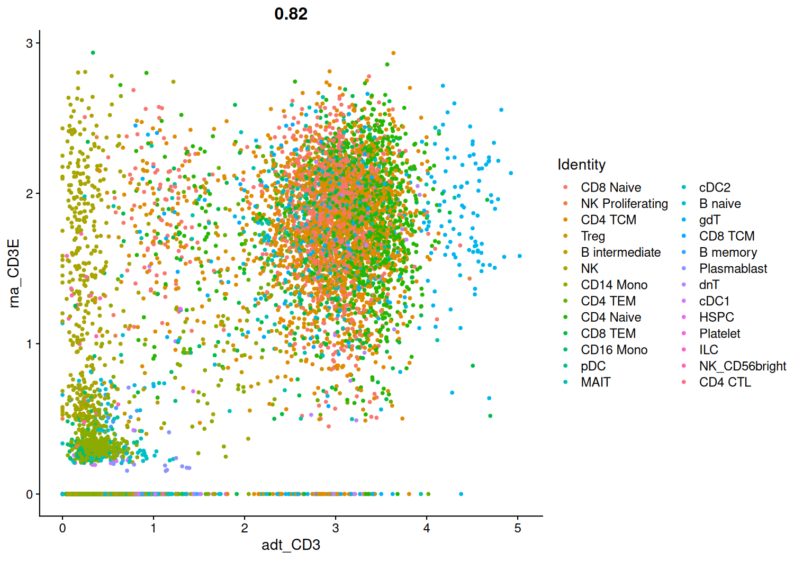

Author: Georg Sommer

# Multimodal CITE-seq Profiling of Human PBMCs with Seurat v5

> **An end-to-end single-cell workflow for quality control, transcriptional clustering, reference-based cell-type annotation, and RNA–protein comparison in a 10,000-cell human PBMC CITE-seq dataset.**

<p align="center">
  
</p>

<p align="center"><em>
Azimuth-annotated UMAP of the PBMC dataset. Distinct cell populations occupy coherent regions of the embedding, providing an overview of cellular heterogeneity and annotation quality.
</em></p>

---

## Research question

**How reliably can joint RNA and antibody-derived tag measurements resolve and validate immune-cell identities in a 10,000-cell human PBMC CITE-seq dataset?**

## Summary

This project applies a Seurat workflow to a 10x Genomics PBMC CITE-seq dataset to identify immune-cell populations from RNA expression and evaluate whether selected surface-protein measurements support the transcriptional annotations.

## Purpose of this work

Peripheral blood mononuclear cells contain multiple immune-cell populations with related transcriptional profiles. RNA measurements provide broad molecular information, while antibody-derived tags (ADTs) measure selected surface proteins that are often directly linked to immune-cell identity. The project is designed as a showcase example of multimodal scRNA-Seq analysis. Note: ADT marker panels have existed for significantly longer than scRNA-Seq.

## Aims

- Identify transcriptionally distinct PBMC populations.
- Determine whether selected RNA and surface-protein markers support consistent immune-cell annotations.
- Compare the PBMC populations to identify lineage markers.

## Dataset

The analysis uses the **10k Human PBMC TotalSeq-B 3′ Gene Expression dataset generated with 10x Genomics GEM-X technology**.

The input HDF5 file contains two count matrices:

- **Gene Expression:** RNA/cDNA counts.
- **Antibody Capture:** antibody-derived tag counts representing selected surface proteins.

Expected local input file:

```text
10k_Human_PBMC_TotalSeqB_3p_gemx_10k_Human_PBMC_TotalSeqB_3p_gemx_count_sample_filtered_feature_bc_matrix.h5
```

The original download command used for the project is included in the analysis script:

```bash
wget https://cf.10xgenomics.com/samples/cell-exp/8.0.0/10k_Human_PBMC_TotalSeqB_3p_gemx_10k_Human_PBMC_TotalSeqB_3p_gemx_count_sample_filtered_feature_bc_matrix.h5
```

## Key results

<br>

<p align="center">
  
</p>

<p align="center"><em>
Marker genes appear to mark the unsupervised clusters quite well.
</em></p>

<br>

#### 1. Expected ADT correlations:

**Which group of cell types does CD19.1 mark?**

B-Cells

**Which group of cell types does CD3 mark?**

T-Cells

<br>

#### 2. RNA counts vs ADT counts:

**For CD19.1 and CD3:**

**Do all cells with high ADT counts have high RNA counts?** 

No

**And the other way round? Do all cells with high RNA counts have high ADT counts**

No

**What might be the reasons for this observation?** 

(low RNA) RNA dropout, (low ADT) post-transcriptional regulation, (both) experimental factors

<p align="center">
  
</p>

<p align="center"><em>
Multimodal plot of CD19 counts from CITESeq. Most B-type cells (naive, intermediate, memory, and plasmablast) have high RNA- and ADT-counts for CD19. The "line" at the bottom shows cells with zero CD19 RNA and varying levels of CD19 ADT.
</em></p>

<p align="center">
  
</p>

<p align="center"><em>
Multimodal plot of CD3 counts from CITESeq. T-type cells mostly have high RNA and ADT for CD3, some have low RNA. Interestingly, non-T cytotoxic cells like NK have CD3 RNA without expressing it as a protein on the cell surface. 
</em></p>

<br>

#### 3. Marker comparisons: Does the difference come from ADT and/or RNA counts when comparing cell types x and y?

**Naive T cell types (CD4 Naive and CD8 Naive)**

Both modes (RNA: CD8 proteins have massive absolute L2FC) (ADT: CD8 and CD4.1 are the only ADTs with big absolute L2FC)

**Central Memory (division pool "CD4 TCM", "CD8 TCM") vs Effector Memory (rapid response force, "CD4 TEM", "CD8 TEM"):**

RNA (GZMA, CCL5, CST7, GZMK, and NKG7 are T cell response genes, which are a blind spot of the ADT assay)

Explanation of the ADT result: Many more CD4 cells in TCM group, CD4 and CD8 more equal numbers in TEM group


## Conclusion:

Differences in the celltypes were consistently observed in RNA counts often supported by differences in the ADT counts.

**So why measure ADT?** 
The ADT data was not strictly required to discover the biological markers, but it did provide technical validation.
The ADT data show:
- RNA transcripts reliably translate into surface proteins for lineage markers (perfect concordance between CD4(.1) ADT/RNA and CD8(A/B) ADT/RNA)
- The limitations of using targeted antibody panels alone for PBMC type ID


## Limitations

- The analysis contains one dataset and does not provide biological replication across donors, conditions, or batches.
- The upper 2% `nFeature_RNA` filter is only a heuristic for unusually complex droplets; a dedicated doublet caller was not applied.
- The mitochondrial threshold of 5% may be appropriate for this dataset but should not be transferred uncritically to other tissues or protocols.
- Selecting 50 PCs because the elbow plot remains gradual may retain useful signal as well as noise.
- A clustering resolution of `0.5` is not uniquely correct and should be tested for stability.
- UMAP is a nonlinear visualization and should not be used alone to infer biological distance or lineage relationships.
- Azimuth predictions depend on the composition, labels, and assumptions of the reference atlas.
- The current workflow compares modalities through selected markers but does not build a joint weighted nearest-neighbor representation.
- RNA–protein relationships are interpreted visually; formal correlation estimates and uncertainty measures are not yet reported.
- No differential analysis between experimental conditions is possible because the dataset represents a single sample context.

---
